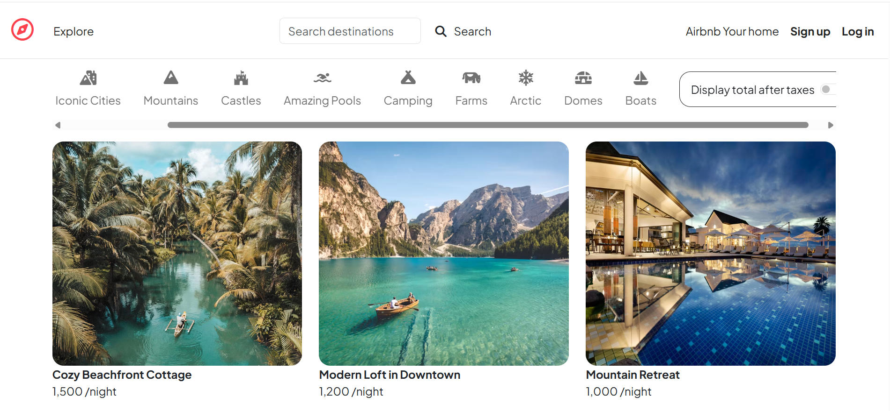
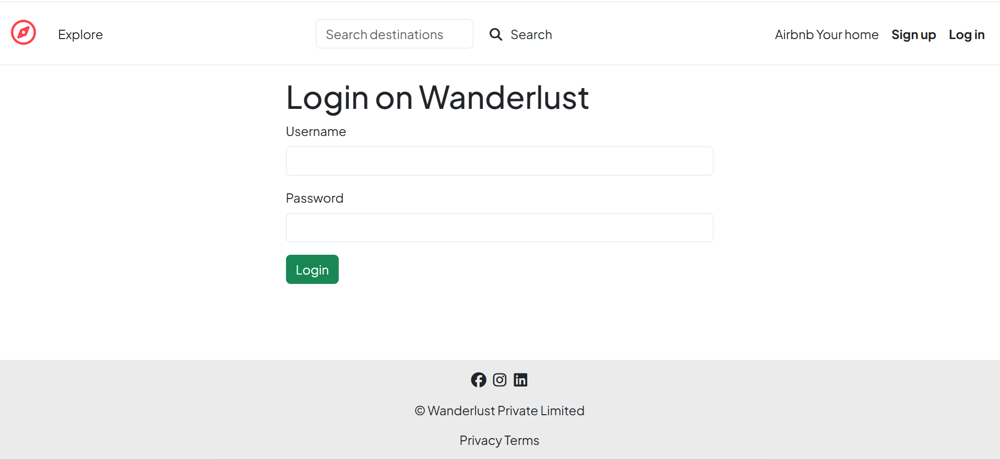
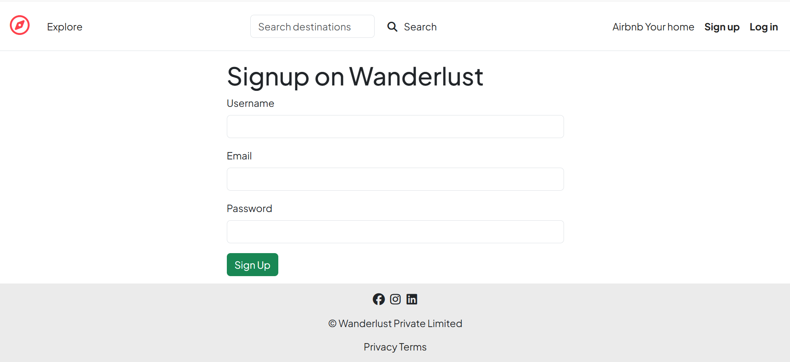
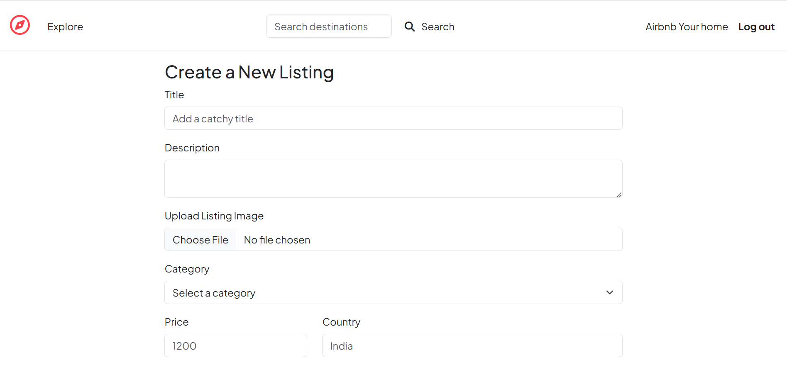
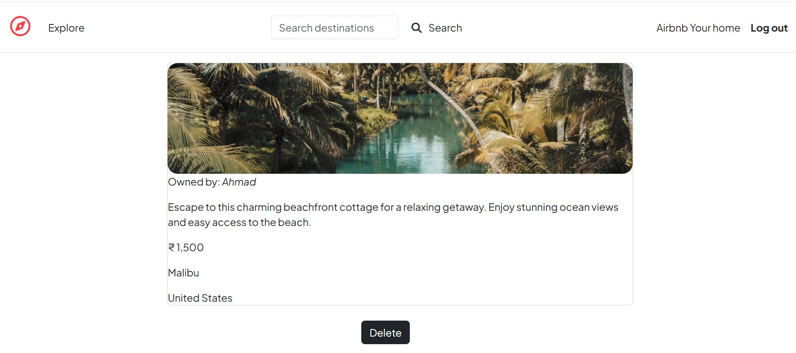
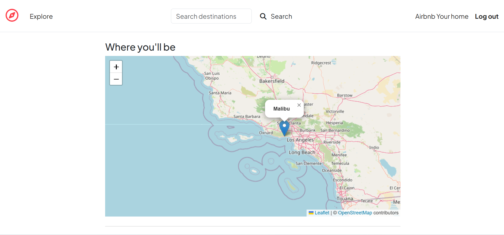
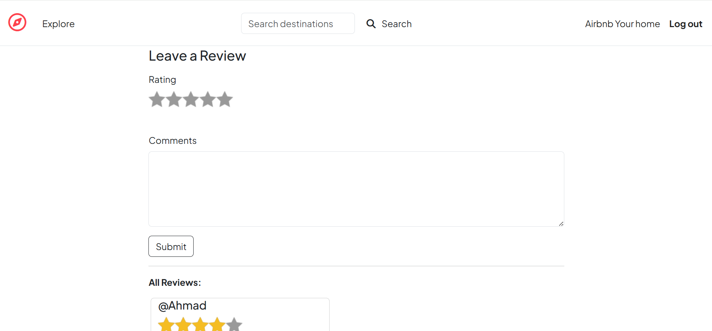

# 🏡 WanderStay

A full-stack accommodation and travel listing web application inspired by Airbnb.

## 🌐 Live Website

🔗 [Visit WanderStay](https://wanderstay-n7ps.onrender.com)

## ✨ Features

- 🔐 User Signup & Login
- 🏠 Create, Edit & Delete Listings
- 🔍 Search Listings
- 🗂️ Browse Listings by Category
- ⭐ Reviews & Ratings
- 🗺️ Location Map
- ☁️ Cloudinary Image Uploads
- 📱 Responsive Design

## 🛠️ Tech Stack

- **Frontend:** HTML, CSS, Bootstrap, JavaScript
- **Backend:** Node.js, Express.js
- **Database:** MongoDB Atlas
- **Authentication:** Passport.js
- **Image Storage:** Cloudinary
- **Deployment:** Render

## 📸 Screenshots

### 🏠 Home Page

### 🔐 Login

### 📝 Signup

### ➕ Create Listing

### 🏡 Listing Details

### 🗺️ Map Location

### ⭐ Reviews

## 👨‍💻 Author

**Ahmad Shaaz**

🔗 [GitHub](https://github.com/Shaaz29)
